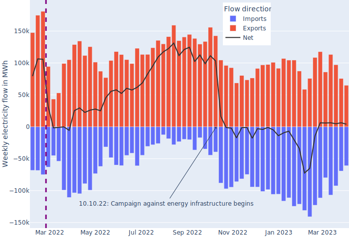
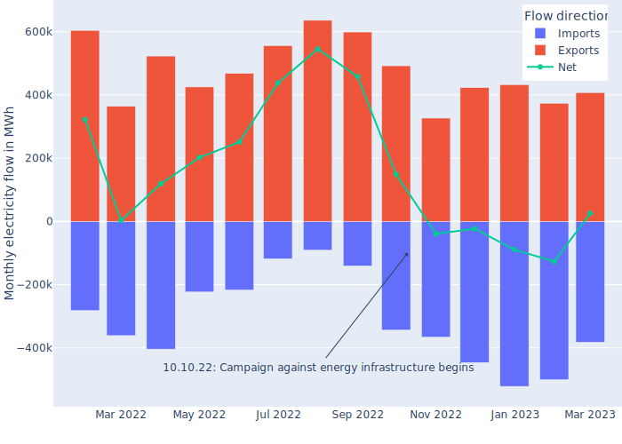
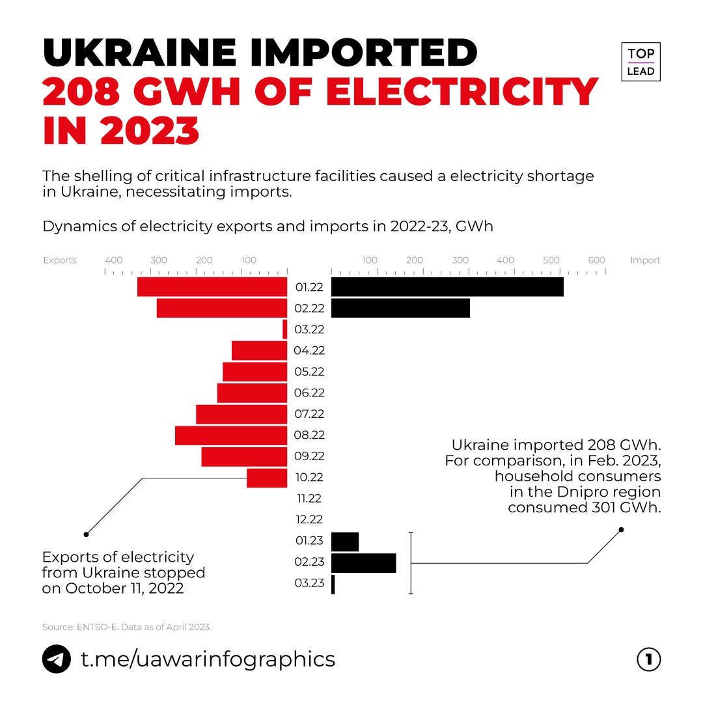

# ENTSO-E Ukraine Electricity Flows

Utilizes data from the ENTSO-E energy transparency platform [transparency.entsoe.eu](https://transparency.entsoe.eu/transmission-domain/physicalFlow/show?name=&defaultValue=false&viewType=GRAPH&areaType=BORDER_CTY&atch=false&dateTime.dateTime=01.01.2023+00:00|CET|DAY&border.values=CTY|10Y1001C--00003F!CTY_CTY|10Y1001C--00003F_CTY_CTY|BY&dateTime.timezone=CET_CEST&dateTime.timezone_input=CET+(UTC+1)+/+CEST+(UTC+2))
as well as [github.com/EnergieID/entsoe-py](https://github.com/EnergieID/entsoe-py) python client.

### Preparation
Install dependencies via `pip install -r requirements.txt`.

### Obtaining data

You will need an API key which can be obtained by emailing ENTSO-E staff. They
reply very quickly, it should not take more than a few minutes during business
hours.

See this article for details:
[thesmartinsights.com: How to query data from the ENTSO-E transparency platform using Python](https://thesmartinsights.com/how-to-query-data-from-the-entso-e-transparency-platform-using-python/)

### Analysis

See the accompanying ipython jupyter notebook:
[entso_e_electricity_ukraine.ipynb](entso_e_electricity_ukraine.ipynb)

Excel and `.csv` files are provided for imports and exports of Hungary, Moldova,
Poland, Romania, Slovakia. Russia and Belarus not considered since their
endpoints return failure notices.

Weekly electricity flows for Ukraine and neighboring countries:

Monthly view:

Comparison to [UA War Inforgraphics](https://t.me/uawarinfographics/2223):

